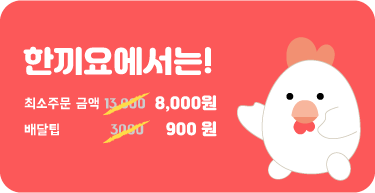
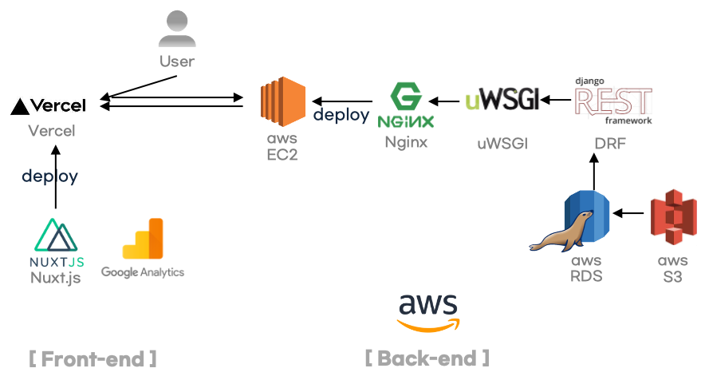
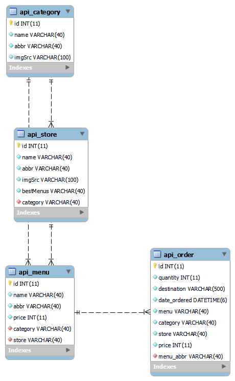
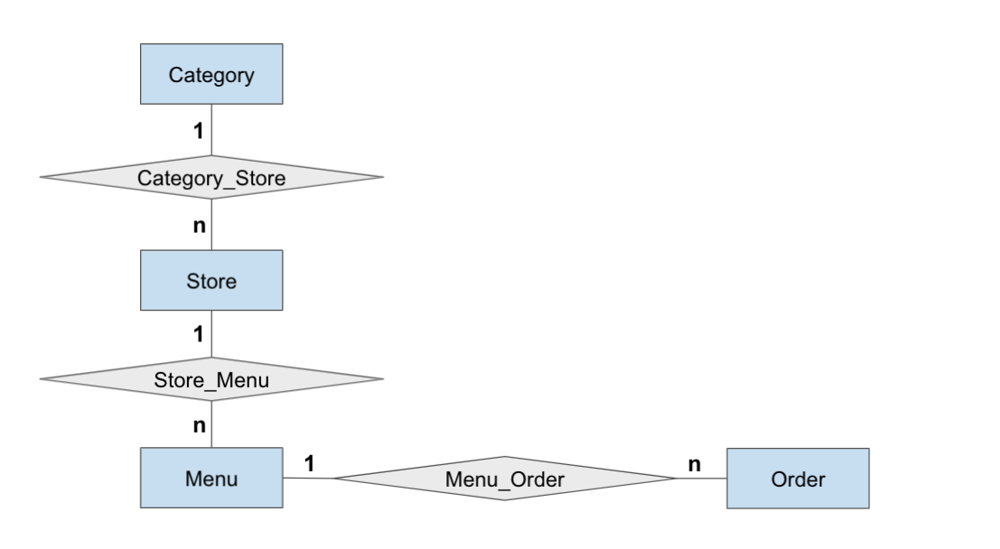
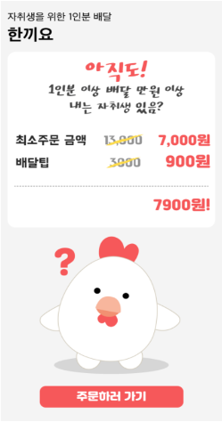
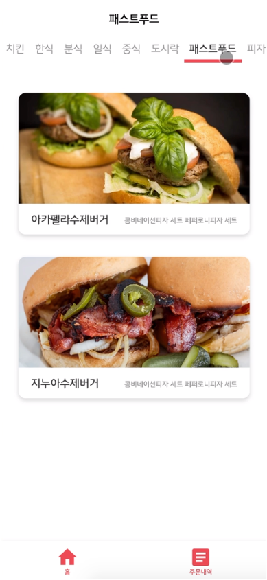
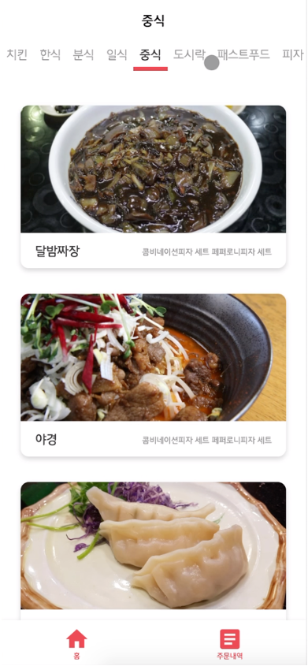
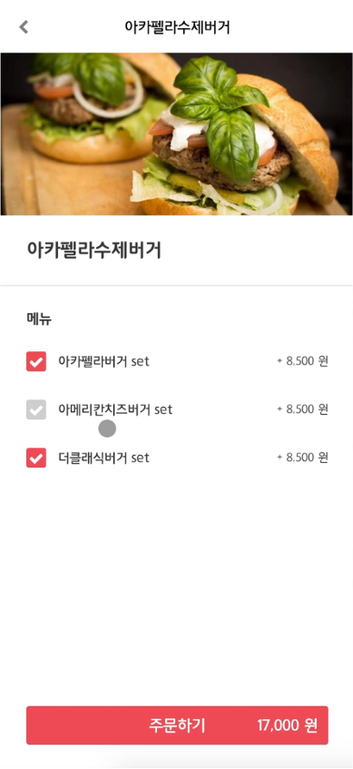
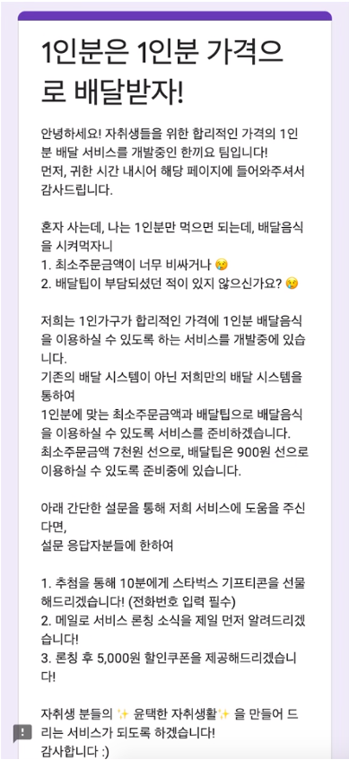

# Hankkiyo MVP
공유배달 플랫폼 "한끼요"의 mvp 모델을 위한 API 서버입니다.

## Service Architecture

- Front-end : nuxt.js by [sebastianrcnt](https://github.com/sebastianrcnt/hankkiyo-nuxt)

- Back-end : Django REST Framework by [code4human](https://github.com/code4human/hankkiyo-mvp)

## E-R Diagram
#### ERD - Type 1

- `Menu` 테이블의 `name` 컬럼은 unique하지 않으며, `abbr`로 구별합니다.
- `Order` 테이블의 `category`, `store`, `price`는 `FK`인 `menu`에서 로직을 통해 접근해서 넣어줍니다. 초기에 `blank=True` 설정을 한 뒤 DB에 입력이 이루어집니다.
- 아래의 형태에서 `Menu : User`는 `N : M`의 관계를 띕니다. 그러나 MVP 서비스는 User를 제외한 간단한 모델이므로, `Menu : Order` 인 `1 : N`관계만 구현했습니다.

#### ERD - Type 2

- 중개모델 `Category_Store`, `Store_Menu`, `Menu_Order`은 Django에 의해 자동생성됩니다.

## Service Page
모바일웹 형태의 Front-end 페이지 이미지입니다.

사용자가 `주문하기` 버튼을 누르는 즉시, 데이터가 서버로 Post되며 설문조사 페이지로 이동합니다.

